# What is this?

The Postman workshop will take you through the basics of OAuth2 in an Azure context and also specifically how to get tokens in Postman. Labs will take you through
* creating a collection with tests against protected and unprotected APIs 
* adding tests to verify expected response 
* Exporting collection and run and publish test results in Github Actions

# Preparation

It is good with some knowledge about Azure AD, but the guide will take you through the steps that you need to do in the azure portal.

If you have never used Postman, make sure to install it and play around with it. They provide a lot of good learning material on https://learning.postman.com/.

# Table of content:
[Lab 0 - Create an App Registration](#lab-0---create-an-app-registration) <br>
[Lab 1 - Postman request](#lab-1---postman-request)<br>
[Lab 2 - OAuth in Postman](#lab-2---oauth-in-postman)<br>
[Lab 3 - Testing in pipeline](#lab-3---testing-in-pipeline)<br>
[So how do you protect it better?](#so-how-do-you-protect-it-better?)<br>

*************************
*************************
# Lab 0 - Create an App registration
1. Go to https://portal.azure.com
1. Use the search field to find "App registrations"
1. Create an App registration with name "PostmanLab-yourName" and default settings. <br>
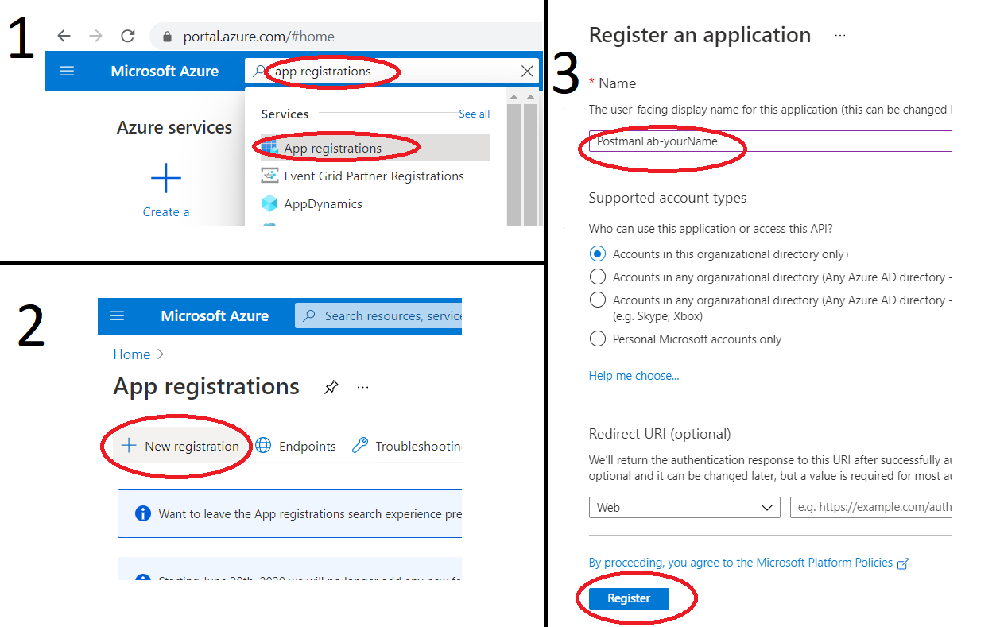

# Lab 1 - Postman request

## Step 1: Call unprotected API from Postman
1. Open Postman. You can either create a new account, or you can choose to skip logging in, it does not matter for this lab.
1. Create new Collection ”PostmanLab” with the + symbol next to "Collecions" (see image)
1. Create new folder ”PostmanLab1” in collection by right-clicking the collection
1. Create new Get-request to URL: `https://postman-lab1.azurewebsites.net/SecretInformation` <br>
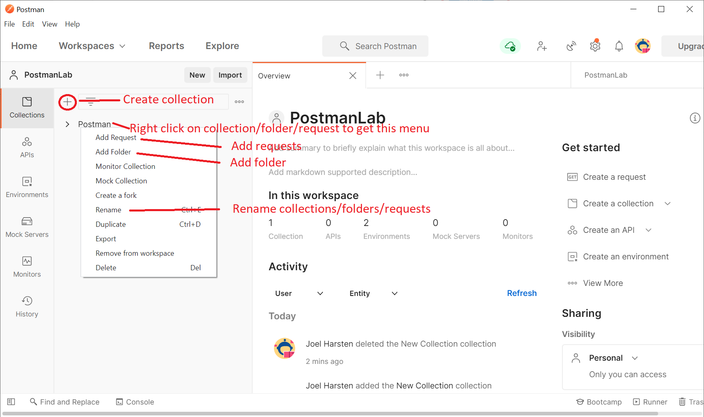
1. Make sure that you save everything you do in Postman. This goes for Requests as well as test-scripts and environments later on. Otherwise you will not get expected behavior. Look out for the orange dot, which marks when something has not been saved.
1. Verify that you get a 200 response status and that the response contains the ”secret” information. <br>
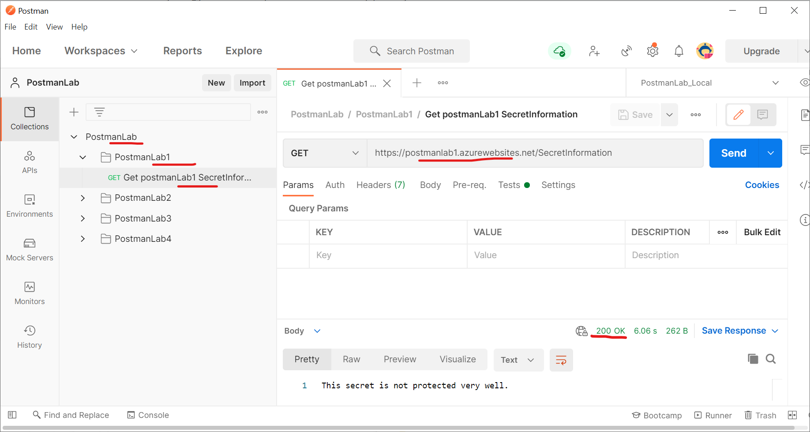

## Step 2: Automated response verification
1. Go to ”Tests”-tab
1. To the right, there is a list with ”Snippets”. Add ”Status code: Code is 200”
1. Change the test name so it represents what is tested on what.
1. Change the status code to 123 and send the request to verify that it fails
1. Change back the status code to 200 and verify that the test becomes green. <br>
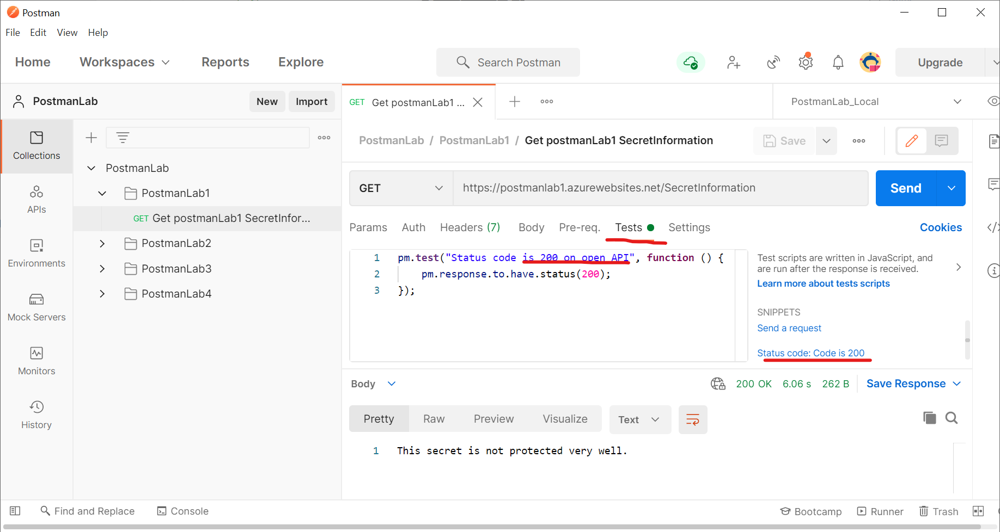

# Lab 2 - OAuth in Postman

## Step 1: Create environment with variables

1. Create new Environment ”PostmanLab”<br>
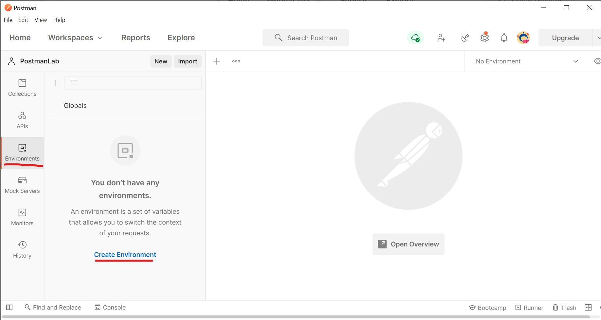
1. Create variables tenant, clientId, clientSecret and scope. See instructions below on how to find the values. Save the value of secrets in "Current Value" instead of "Initial Value". This way the secrets are not synched to Postman servers. If you are running Postman without logging in, all values need to be in "Current Value", when you are logged in, they are automatically copied to "Current Value" when you paste them in "Initial Value". **Make sure you save the environment every time you make changes!** <br>
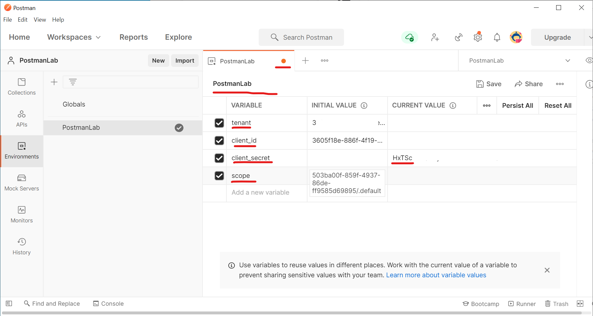
1. Copy clientId and tenant from the overview page of the App Registration you created before.  <br>

1. Create a secret in in "Certificates & secrets" and copy the value to the "Current Value" of client_secret. <br>

1. Find the scope by going back to All App registrations and searching for Postman-Lab2. Copy clientId and add "/.default". <br>
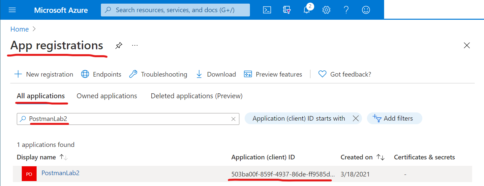
1. Choose your environment in the dropdown in the top right corner where it says "No Environment".

## Step 2: Setup token request

1. Create new folder ”PostmanLab2”.
1. Create POST request to the url `https://login.microsoftonline.com/{{tenant}}/oauth2/v2.0/token`
1. Make sure you have your environment selected in the top right corner (as in the image below).
1. Go to the Body tab of the request and fill in the variables as in the image. You should be able to see the variable value if you hover over them with your mouse. <br>
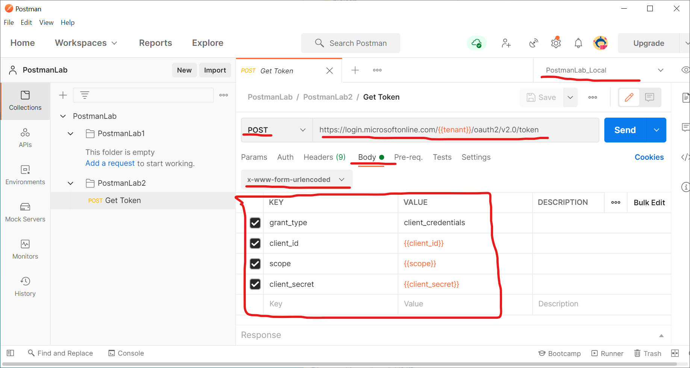
1. Add test for Status 200 and save.
1. Send request for token and verify that the test becomes green

## Step 3: Save token in environment variables

1. Add snippets ”Response body: JSON value check”, but only use the json-parsing command
2. Add snippet ”Set an environment variable” and put the access token from the parsed response in a variable. The test should now look like this:
```javascript
pm.test("Status code is 200 when getting postmanLab2Token", function () {
    pm.response.to.have.status(200);
});

var jsonData = pm.response.json();

pm.environment.set("postmanLab2Token", jsonData.access_token);
```
3. Send and verify that an environmentvariable has been set with a value starting with eyJ…

## Step 4: Use token in request to postmanlab2 endpoint

1. Create new Get-request to URL: `https://postman-lab2.azurewebsites.net/SecretInformation`
1. Verify that you get 401 Unauthorized
1. Automate this verification like before
1. Create new Get-request to URL: `https://postman-lab2.azurewebsites.net/SecretInformation`. Go to the Header tab and add ”Authorization” with value: `Bearer {{postmanLab2Token}}`. Only add the authorization header - in the image there are other headers which might be marked as "hidden" in your view. Make sure that this test comes after the token request, because when we run the whole collection automatically, the tests will be run in order.
1. Verify that you get 200
1. Adjust test to verify 200 <br>
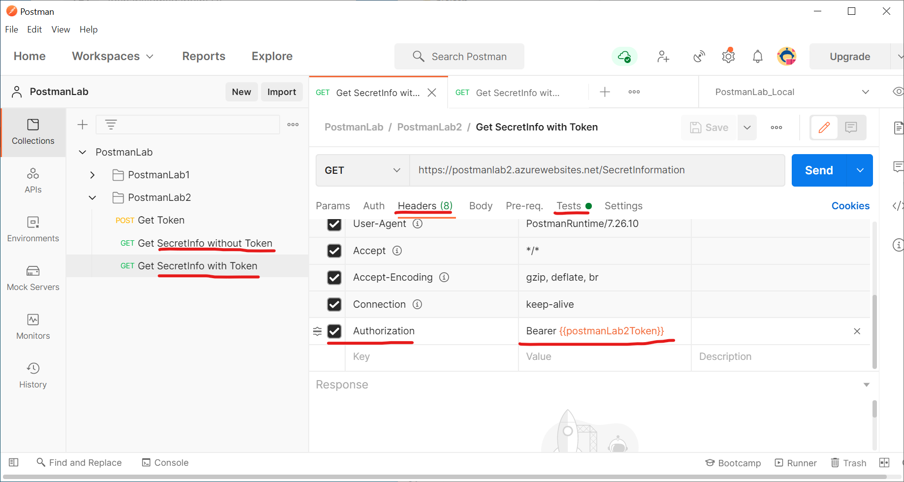

# Lab 3 - Testing in pipeline

## Step 1: Setup Github Action Workflow

1. Create a repository in github
1. In the repository settings, create a secret "client_secret". Paste the value of a new secret that you create in the same way you did before and invalidate the secret you used locally when you are finished working with it. Save.
1. Clone the repository to your computer.

## Step 2: Export Postman tests

1. Insert value #{client_secret}# in "initial value" for client_secret. We will replace this value in the pipeline. There is no need to delete the current value.
1. Export Environment by going to the environment edit view and click on the three dots. Put the file in the same folder as the collection <br>
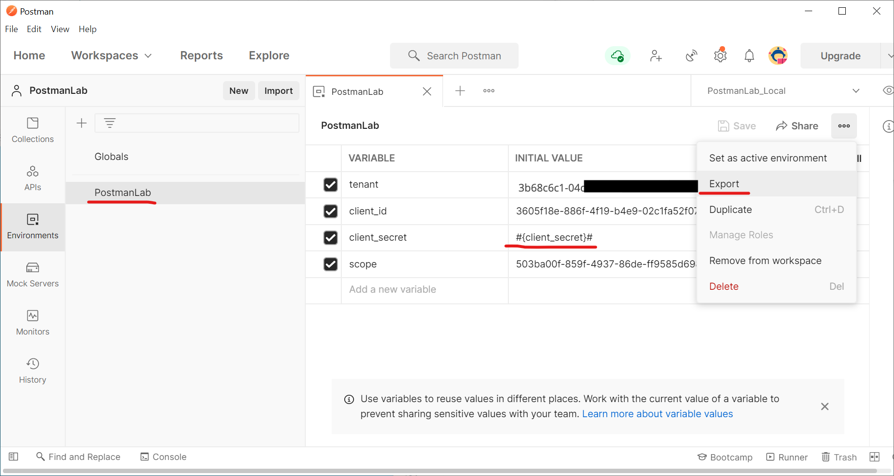
1. Export the collection by right clicking and export. Save it in the cloned repository <br>
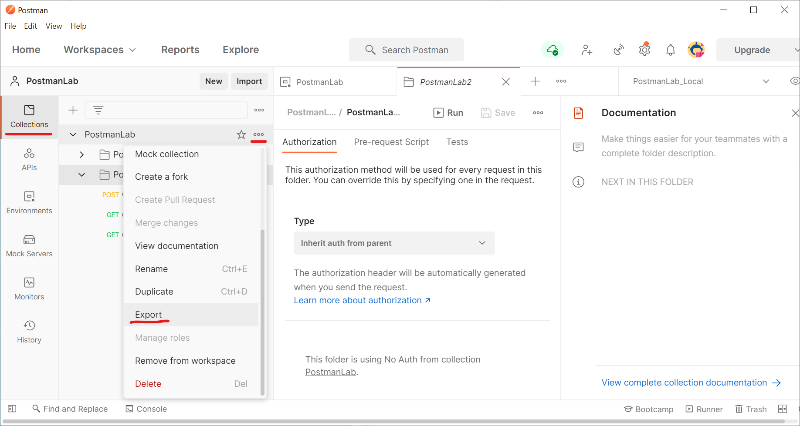
1. Make sure you add and commit and push the files to your repository. If you run git in the command prompt run the following commands:
```
git add .
git commit -m "Add Postman tests in pipeline"
git push
```

## Step 3: Run tests in pipeline

1. Go to the "Actions"-tab in github and create a new Workflow
2. Setup a simple workflow and adjust it to look like the script below. Make sure to get indentations right. Also make sure that the names of the postman files are correct in the `run: newman run ...` step.
```yaml
name: Run Postman Collection

on:
  workflow_dispatch:

jobs:
  test:
    runs-on: ubuntu-latest
    steps:
      - uses: actions/checkout@v2
      - name: Download newman
        run: sudo npm install newman -g
      - uses: cschleiden/replace-tokens@v1
        with:
          files: '["**/*.json"]'
        env:
          clientSecret: ${{ secrets.clientSecret }}
      - name: Run Postman tests with newman
        run: newman run PostmanLab.postman_collection.json -e PostmanLab.postman_environment.json --reporters cli,junit
        continue-on-error: true
      - name: Publish Unit Test Results
        uses: EnricoMi/publish-unit-test-result-action@v1
        with:
          files: newman/*.xml
```
3. Press "Start Commit". The action should run automatically. Go to the Workflow and see if it was successful. You should be able to see "Test results" where the Postman test results are listed. <br>

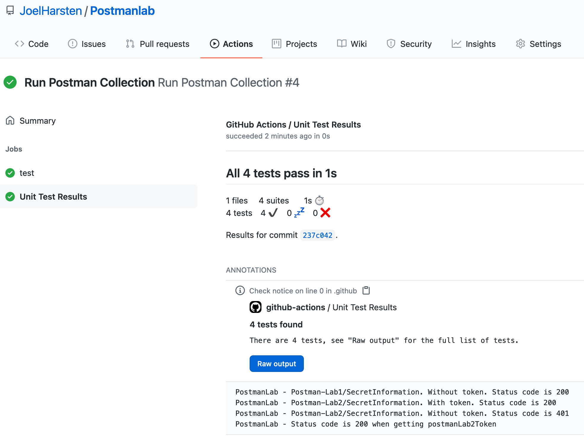

## Common issues:

* The client_secret is not successfully replaced in the environment file. Check in the pipeline run if the token was replaced. If there are 0 tokens replaced, that means there is a mismatch in the name of the secret variable, and the value inside #{client_secret}#. <br>
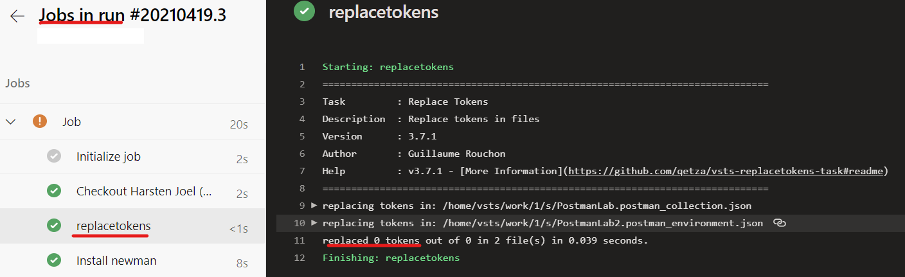

* The names of the postman collection and environment files in the repository does not match the ones specified in the pipeline newman-command. <br>
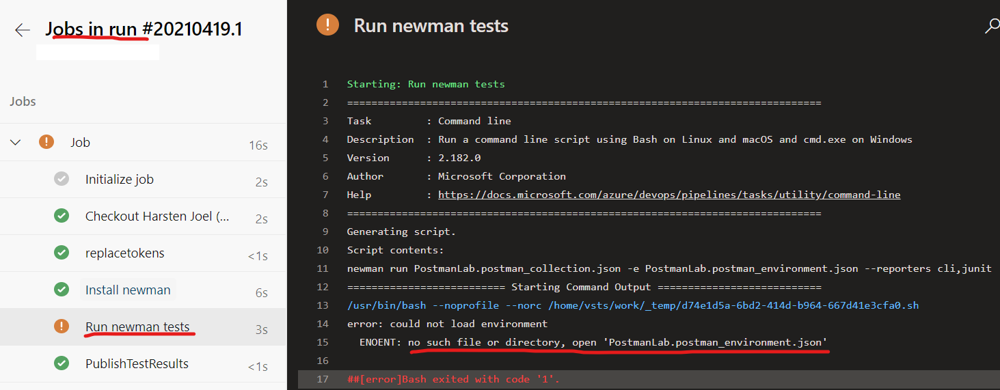

* You get 401 instead of 200. 
    - Check that the Requests are in the correct order. The requests are run in the order they appear in Postman. The token requests need to be before the request using the token.
    - Check in the exported Environment json-file that the values of the variables are as expected.

# So how do you protect it better?

For all services that you protect with OAuth2 in Azure AD, you need to turn on "User Assignment Required". This is done in the Enterprise Application corresponding to your App registration and go to properties > turn on User Assignment Required. Then you can add Users & Groups to the default role in Users & Groups. You can also specify different roles in the App Registration. If you want to give access to a specific service, you have to create an App Role in the App registration. But you will not be able to assign the role to a service in the UI. Instead you have to use a powershell script:

```powershell
$CallingService = "<ObjectID of the calling service Enterprise Application. It can be either a Managed Identity, or the Enterprise Application corresponding to an App Registration>"
$ProtectedService = "<ObjectID of the Protected service Enterprise Application>"
$AppRoleId = "<ID of AppRole on Protected service>"
New-AzureADServiceAppRoleAssignment -ObjectId $CallingService -PrincipalId $CallingService -ResourceId $ProtectedService -id $AppRoleId 
```